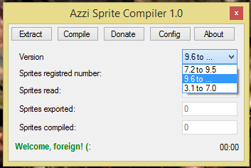

# azzi-sprite-decompiler
Da série "coisas que desenvolvi quando participava das comunidade de Open Tibia entre 2007 e 2010"

Transforma o arquivo SPR do tibia em imagens editáveis, e consegue reescrever o arquivo SPR depois
de alterações das sprites.

